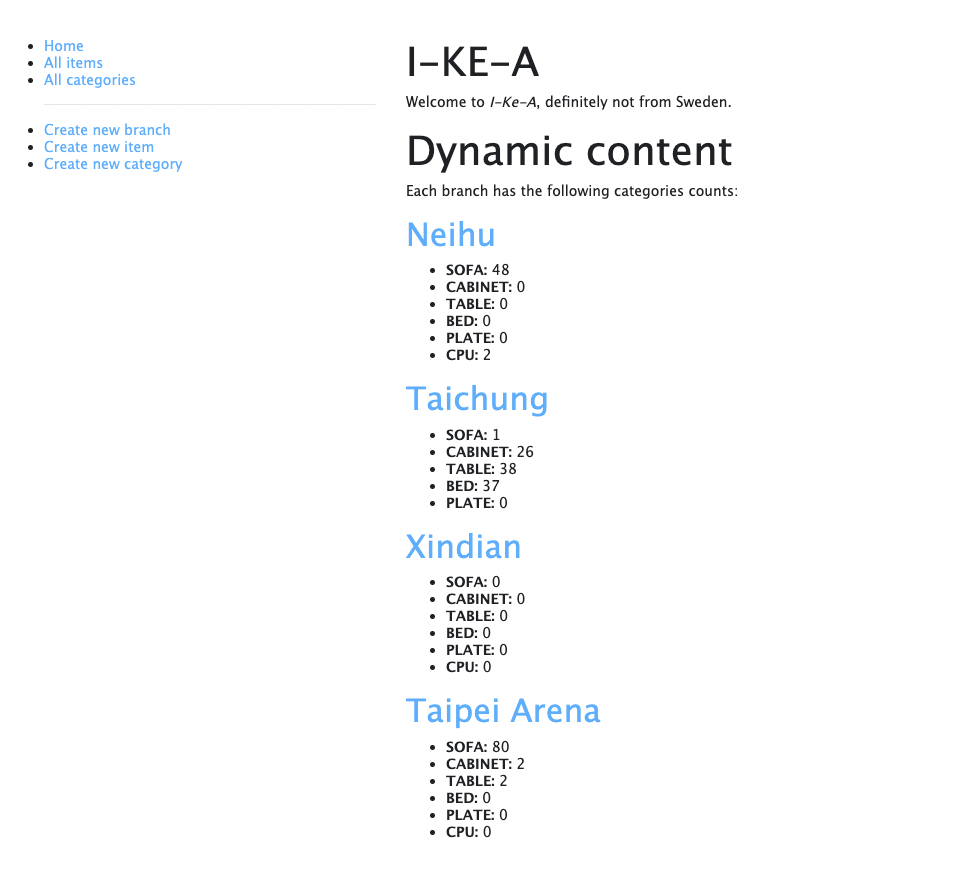
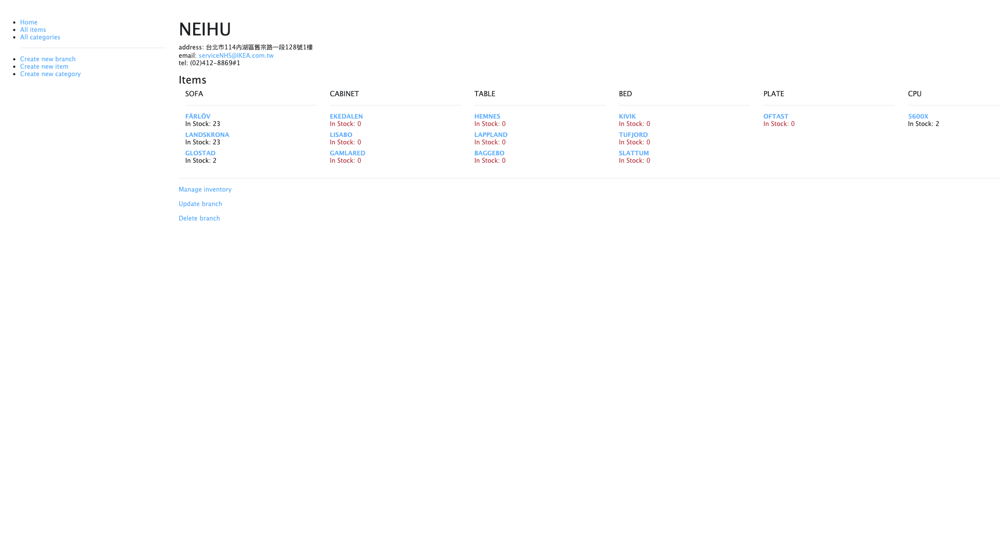
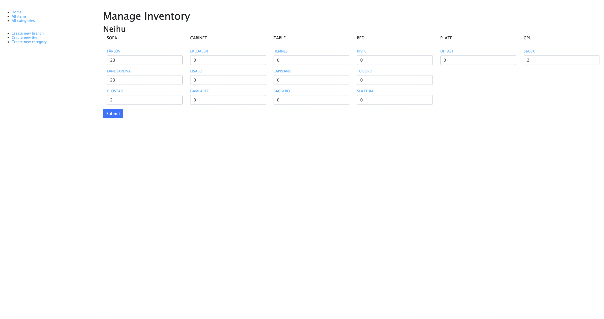
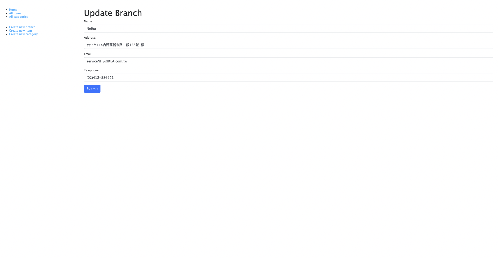
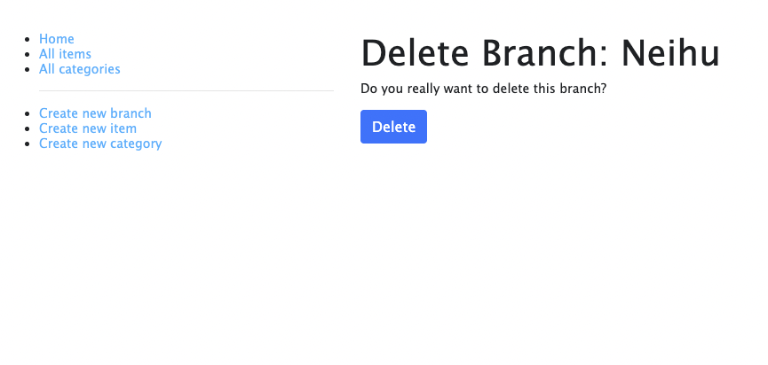
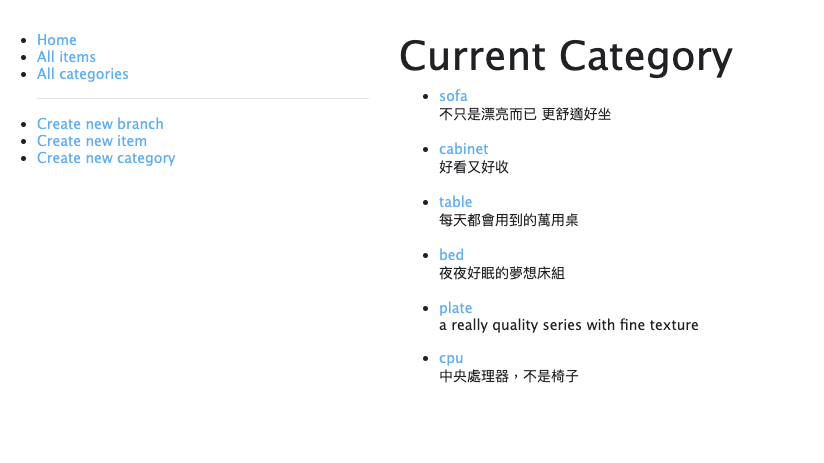
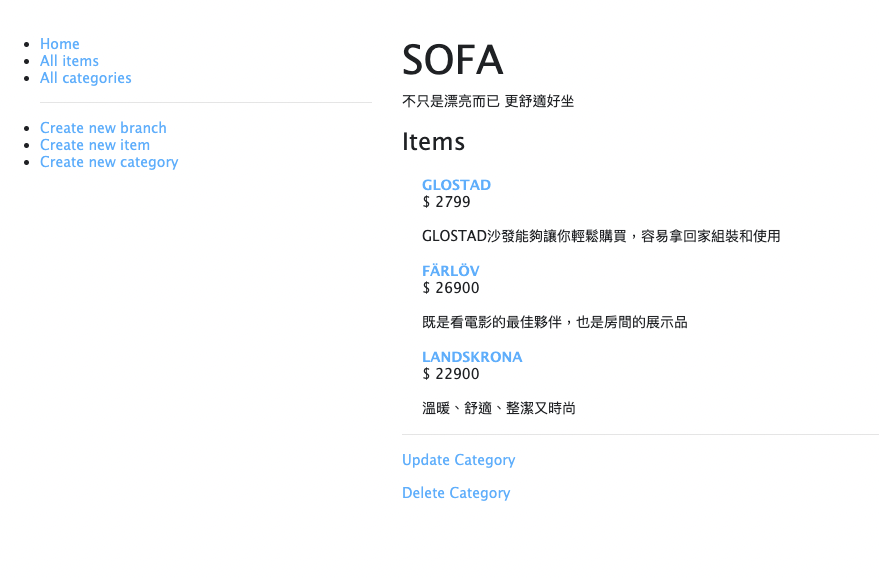
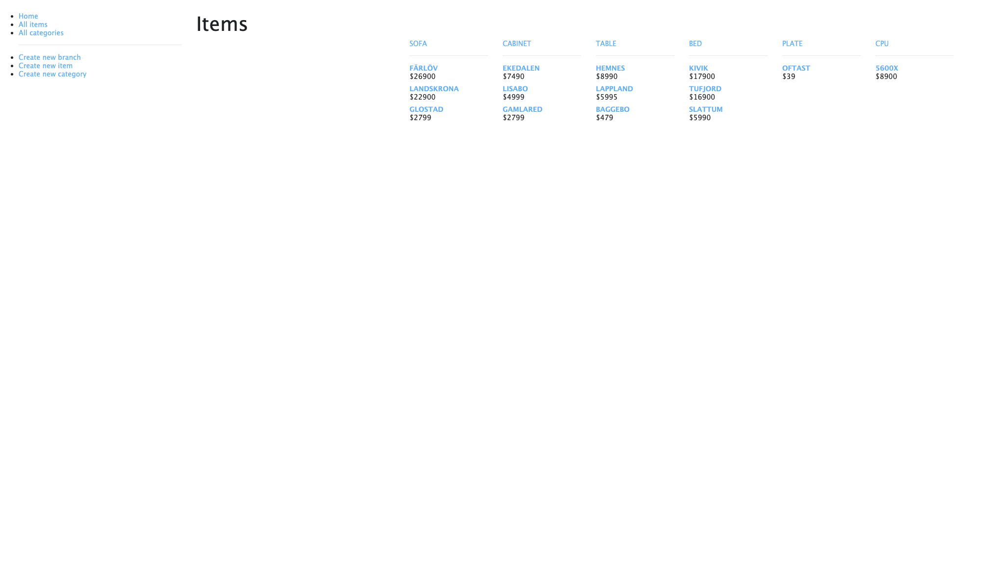
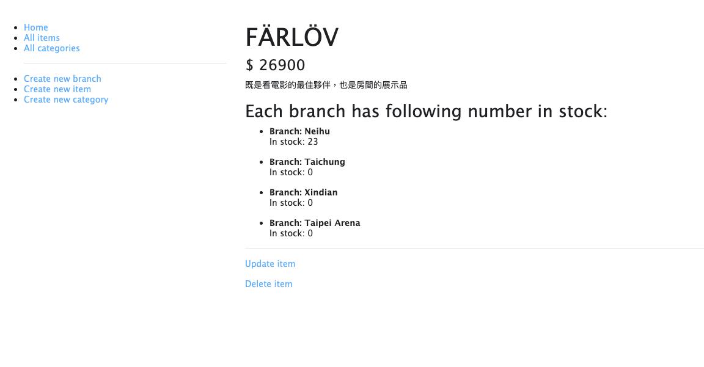

# I-KE-A Inventory Managing System

[The Odin Project 的 CRUD 練習專案](https://www.theodinproject.com/paths/full-stack-javascript/courses/nodejs/lessons/inventory-application)

I-KE-A，一間不一定是瑞典來的公司庫存管理系統。

## [Demo](https://obscure-retreat-56413.herokuapp.com/branch)

首頁

分店庫存

庫存管理

更改分店資訊

刪除分店

商品種類清單

該商品種類的物品

商品清單

商品詳細資訊

* 2022.02.09 新增 dotenv